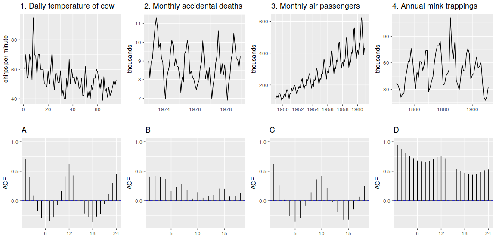
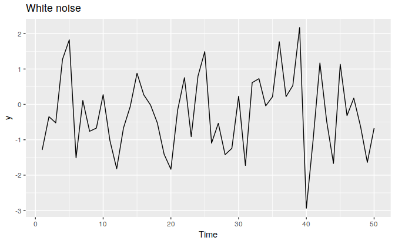
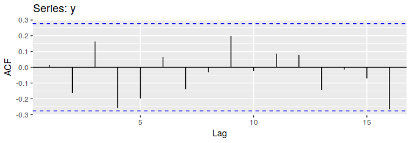

```{r setup, include=FALSE}
knitr::opts_chunk$set(echo = TRUE)
```

```{r}
library(fpp2)
library(ggthemes)
theme_set(theme_economist())
```


### Question 1: {.tabset}
Use the help function to explore what the series `gold`, `woolynrq` and `gas` represent.

(a) Use `autoplot()` to plot each of these in separate plots.

#### `gold`
```{r}
autoplot(gold) + labs(x = "time", y = "price, in US dollars", 
                      title = "Daily Morning Gold Prices",
                      subtitle = "from Jan 1 1985 to March 31 1989")
```

#### `woolynrq`
```{r}
autoplot(woolyrnq) + labs(x = "time", y = "quantity of yarn, in tonnes", 
                          title = "Quarterly Production of Woollen Yarn",
                          subtitle = "in Australia")
```

#### `gas`
```{r}
autoplot(gas) + labs(x = "time", y = "quantity of gas", 
                     title = "Monthly Gas Production",
                     subtitle = "from 1956 to 1995 in Australia") 
```

## {-}

(b) What is the frequency of each series? Hint: apply the `frequency()` function.

```{r}
frequency(gold)
frequency(woolyrnq)
frequency(gas)
```

The frequency of `gold` is $1$, meaning the series shows yearly data. The frequency of `woolrynq` is $4$, meaning the series shows quarterly data. Finally, the frequency of `gas` is $12$, meaning the series shows monthly data. This all reflects the documentation provided for each of the time series.

(c) Use `which.max()` to spot the outlier in the `gold` series. Which observation was it?
```{r}
paste("The outlier is at time ", which.max(gold), " and its value is ", gold[which.max(gold)], '.', sep = '')
```

### Question 2: {.tabset}
Download the file `tute1.csv` from the book website (http://otexts.com/fpp2/extrafiles/tute1.csv), open it in Excel (or some other spreadsheet application), and review its conents. You should find four columns of information. Columns B through D each contain a quarterly series, labelled Sales, AdBudget and GDP. Sales contains the quarterly sales for a small company over the period $1981$-$2005$. AdBudget is the advertising budget and GDP is the gross domestic product. All series have been adjusted for inflation.

(a) You can read the data into `R` with the following script:
```{r}
tute1 = read.csv("tute1.csv", header=TRUE)
```

(b) Convert the data to time series.
```{r}
mytimeseries = ts(tute1[,-1], start=1981, frequency=4)
```
(The `[,-1]` removes the first column which contains the quarters as we don't need them now.)

(c) Construct time series plots of each of the three series. Check what happens when you don't include `facets=TRUE`.

#### `facets=TRUE`
```{r}
autoplot(mytimeseries, facets=TRUE) + labs(title = "Tute", 
                                           x = "year", y = "value")
```

#### `facets=FALSE`
```{r}
autoplot(mytimeseries, facets=FALSE) + labs(title = "Tute",
                                            x = "year", y = "value") + 
  theme(legend.position = "bottom")
```

## {-}

When `facets=TRUE` is not included, the three plots appear on 1 plot, which can look confusing in this case because not all variables have similar meaning.

### Question 3: {.tabset}
Download some monthly Australian retail data from the book website (https://otexts.com/fpp2/extrafiles/retail.xlsx). These represent retail sales in various categories for different Australian states, and are stored in a MS-Excel file.

(a) You can read the data into `R` with the following script:
```{r}
retaildata = readxl::read_excel("retail.xlsx", skip=1)
```
The second argument (`skip=1`) is required because the Excel sheet has two header rows.

(b) Select one of the time series:
```{r}
myts = ts(retaildata[, "A3349338X"], frequency=12, start=c(1982,4))
```

(c) Explore your chosen retail time series using the following functions:
`autoplot()`, `ggseasonplot()`, `ggsubseriesplot()`, `gglagplot()`, `ggAcf()`

Can you spot any seasonality, cyclicity and trend? What do you learn about the series?

#### `autoplot`
```{r}
autoplot(myts) + ggtitle("Time Series Plot") + labs(x = "year")
```

#### `ggseasonplot`
```{r}
ggseasonplot(myts) + ggtitle("Seasonal Plot") + 
  scale_color_manual(values = colorRampPalette(c("darkred", "coral", "darkorange"))(32)) + 
  theme(legend.position = "right")
```

#### `ggsubseriesplot`
```{r}
ggsubseriesplot(myts) + ggtitle("Subseries Plot")
```

#### `gglagplot`
```{r}
gglagplot(myts) + ggtitle("Lag Plot") + 
  scale_color_manual(values = colorRampPalette(c("darkgreen", "darkolivegreen1"))(12)) + 
  theme_economist() + theme(legend.position = "right")
```

#### `ggAcF`
```{r}
ggAcf(myts) + ggtitle("Autocorrelation Plot")
```

## {-}

It appears to be that retail sales dipped around 2001 and then went back up as well as in 2011 and went up again. When viewing the sales by month, it is apparent that sales are at the highest in December, presumably due to the Christmas season. There also seems to be a sharp increase in sales from June to July. When viewing month sales, the average retail sales hovers around $180$ for all months except December where it reaches over $200$. Lagged values of the time series do not show any apparent lagged relations. As demonstrated in the autocorrelation plot, the decrease in the ACF shows that there is some trend as well as some seasonality since ACF goes up every $12$ lags rather than down. 

### Question 4: {.tabset}
Create time plots of the following time series: `bicoal`, `chicken`, `dole`, `usdeaths`, `lynx`, `goog`, `writing`, `fancy`, `a10`, `h02`.

* Use `help()` to find out about the data in each series.
* For the `goog` plot, modify the axis labels and title.

#### `bicoal`
```{r}
autoplot(bicoal) + labs(title = "Annual Bituminous Coal Production",
                        x = "year", y = "production")
```

#### `chicken`
```{r}
autoplot(chicken) + labs(title = "Price of Chicken", 
                         x = "year", y = "price, in US dollars")
```

#### `dole`
```{r}
autoplot(dole) + labs(title = "Number of People", 
                      subtitle = "Getting Unemployment Benefits in Australia",
                      x = "year", y = "total number of people")
```

#### `usdeaths`
```{r}
autoplot(usdeaths) + labs(title = "Accidental Deaths in US",
                          x = "year", y = "number of deaths")
```

#### `lynx`
```{r}
autoplot(lynx) + labs(title = "Annual Canadian Lynx Trappings",
                      subtitle = "from 1821-1934", 
                      x = "year", y = "number of lynx trapped")
```

#### `goog`
```{r}
ts(goog, start = c(2013, 02), end = c(2017, 02), frequency = 365) %>% 
  autoplot + 
  labs(title = "Daily Closing Stock Prices of Google Inc",
       subtitle = "from Feb 25 2013 to Feb 13 2017",
       x = "year", y = "stock price")
```

#### `writing`
```{r}
autoplot(writing) + labs(title = "Sales of Printing and Writing Paper",
                         subtitle = "from Jan 1963 to Dec 1972",
                         x = "year", y = "sales, in price of French francs")
```

#### `fancy`
```{r}
autoplot(fancy) + labs(title = "Sales for a Souvenir Shop",
                       subtitle = "in Queensland, Australia",
                       x = "year", y = "sales")
```

#### `a10`
```{r}
autoplot(a10) + labs(title = "Monthly Anti-Diabetic Drug Sales", 
                     subtitle = "in Australia, from 1991-2008",
                     x = "year", y = "number of monthly scripts")
```

#### `h02`
```{r}
autoplot(h02) + labs(title = "Montly Corticosteroid Drug Sales",
                     subtitle = "in Australia from July 1991 - June 2008",
                     x = "year", y = "number of montly scripts")
```

## {-}


### Question 5: {.tabset}
Use the `ggseasonplot()` and `ggsubseriesplot()` functions to explore the seasonal patterns in the following time series: `writing`, `fancy`, `a10`, `h02`.

* What can you say about the seasonal patterns? 
* Can you identify any unusual years?

*Note:* Seasonal plots are plotted such that lighter shades represent earlier years and darker greens represent later years.

#### `writing`
```{r}
ggseasonplot(writing) + 
  labs(title = "Sales of Printing and Writing Paper",
       subtitle = "Seasonal Plot", x = "month", y = "sales") + 
  scale_color_manual(values = 
                       colorRampPalette(c("darkolivegreen1", "darkgreen"))(12))
ggsubseriesplot(writing) + 
  labs(title = "Sales of Printing and Writing Paper",
       subtitle = "Subseries Plot", 
       x = "month", y = "sales")
```

It is evident that August experiences the lowest number of sales of printing and writing paper . There does not appear to be any unusual year. As years go by, the sales of printing and writing paper goes up. 

#### `fancy`
```{r}
ggseasonplot(fancy) + 
  labs(title = "Sales for a Souvenir Shop",
       subtitle = "in Queensland, Australia",
       x = "month", y = "sales") + 
  scale_color_manual(values = 
                       colorRampPalette(c("darkolivegreen1", "darkgreen"))(12))
ggsubseriesplot(fancy) + 
  labs(title = "Sales for a Souvenir Shop",
       subtitle = "in Queensland, Australia",
       x = "month", y = "sales")
```

Later months appear to have more souvenir sales than the earlier years. This shows that there is more tourist activities in Queensland in the summer months. There is no unusual year. 

#### `a10`
```{r}
ggseasonplot(a10) + 
  labs(title = "Monthly Anti-Diabetic Drug Sales", 
       subtitle = "in Australia, from 1991-2008",
       x = "month", y = "number of monthly scripts") + 
  scale_color_manual(values = 
                       colorRampPalette(c("darkolivegreen1", "darkgreen"))(18))
ggsubseriesplot(a10) + 
  labs(title = "Monthly Anti-Diabetic Drug Sales", 
       subtitle = "in Australia, from 1991-2008",
       x = "month", y = "number of monthly scripts")
```

January experiences higher sales in anti-diabetic drugs as compared to other months. In 2008, the sales of anti-diabetic drugs goes down from February to March whereas in other years it went up. 

#### `h02`
```{r}
ggseasonplot(h02) + 
  labs(title = "Montly Corticosteroid Drug Sales",
       subtitle = "in Australia from July 1991 - June 2008", 
       x = "month", y = "number of monthly scripts") + 
  scale_color_manual(values = 
                       colorRampPalette(c("darkolivegreen1", "darkgreen"))(18))
ggsubseriesplot(h02) + 
  labs(title = "Montly Corticosteroid Drug Sales",
       subtitle = "in Australia from July 1991 - June 2008", 
       x = "month", y = "number of monthly scripts")
```

Monthly sales are the lowest in February and then go up until the end of January when it drops drastically. In 2008, sales of corticosteroid goes up between March and April, which is not seen on previous years.


### Question 6: 
Use the following graphics functions: `autoplot()`, `ggseasonplot()`, `ggsubseriesplot()`, `gglagplot()`, `ggAcf()` and explore features from the following time series: `hsales`, `usdeaths`, `bricksq`, `subsplotarea`, `gasoline`.

* Can you spot any seasonality, cyclicity and trend?
* What do you learn about the series?

#### `hsales` {.tabset}
##### `autoplot`
```{r}
autoplot(hsales) + labs(title = "Sales of One-Family Houses",
                        subtitle = "in the US since 1973",
                        x = "year", y = "number of houses")
```

##### `ggseasonplot`
```{r}
ggseasonplot(hsales) + labs(title = "Sales of One-Family Houses",
                            subtitle = "Seasonal Plot",
                            x = "month", y = "number of houses") + 
  scale_color_manual(values = colorRampPalette(c("beige", "bisque4",
                                                 "burlywood1", "burlywood3"))(23)) + 
  theme(legend.position = "right")
```

##### `ggsubseriesplot`
```{r}
ggsubseriesplot(hsales) + labs(title = "Sales of One-Family Houses",
                               subtitle = "Subseries Plot",
                               x = "month", y = "number of houses")
```

##### `gglagplot`
```{r}
gglagplot(hsales) + labs(title = "Sales of One-Family Houses",
                         subtitle = "Lag Plot") + theme_economist() + 
  theme(legend.position = "right")
```

##### `ggAcf`
```{r}
ggAcf(hsales, 200) + labs(title = "Sales of One-Family Houses",
                     subtitle = "ACF Plot")
```

## {-}

Sales of houses in the US seem to peak in 1986 and experience a low in 1975. House sales tend to be higher around March and April and then go down as the year progresses. A lag of $1$ or $2$ seems to have a positive relationship with each month. All other lags do not seen to have a positive relationship with one another. Thus there is seasonality and cyclicity. There appears to be a pattern in the ACF as well. 

#### `usdeaths` {.tabset}
##### `autoplot`
```{r}
autoplot(usdeaths) + labs(title = "Accidental Deaths",
                        subtitle = "in the US from 1973 to 1978",
                        x = "year", y = "number of deaths")
```

##### `ggseasonplot`
```{r}
ggseasonplot(usdeaths) + labs(title = "Accidental Deaths",
                              subtitle = "in the US from 1973 to 1978",
                              x = "month", y = "number of deaths") + 
  scale_color_manual(values = colorRampPalette(c("beige", "bisque4",
                                                 "burlywood1", "burlywood3"))(23)) + 
  theme(legend.position = "right")
```

##### `ggsubseriesplot`
```{r}
ggsubseriesplot(usdeaths) + labs(title = "Accidental Deaths",
                                 subtitle = "in the US from 1973 to 1978",
                                 x = "month", y = "number of deaths")
```

##### `gglagplot`
```{r}
gglagplot(usdeaths) + labs(title = "Accidental Deaths",
                        subtitle = "in the US from 1973 to 1978") + 
  theme_economist() + 
  theme(legend.position = "right")
```

##### `ggAcf`
```{r}
ggAcf(usdeaths, 50) + labs(title = "Accidental Deaths",
                       subtitle = "in the US from 1973 to 1978")
```

## {-}

The number of accidental deaths experienced a high in 1973 and has been decreasing in cycles til 1976 where it starts to increase and decrease. July experiences the highest number of accidental deaths whereas February experiences the lowest number of accidental deaths. In each month, the number of accidental death is highest at the beginning of the month. At around the midpoint of each month, number of accidental deaths pick up. A lag of $12$ indicates positive relations between each month. This makes sense since the data is recorded by month. A negative relation between each month is seen at lag $4$ and $8$. The ACF plot indicates a peak eery $12$ months and a negative peak in between those peaks, right in the middle. This indicates seasonality.


#### `bricksq` {.tabset}
##### `autoplot`
```{r}
autoplot(bricksq) + labs(title = "Quarterly Production of Clay Bricks",
                        subtitle = "in Australia from 1956 to 1994",
                        x = "year", y = "number of bricks")
```

##### `ggseasonplot`
```{r}
ggseasonplot(bricksq) + labs(title = "Quarterly Production of Clay Bricks",
                            subtitle = "Seasonal Plot",
                            x = "quarter", y = "number of bricks") + 
  scale_color_manual(values = colorRampPalette(c("beige", "bisque4",
                                                 "burlywood1", "burlywood3"))(39)) + 
  theme(legend.position = "right")
```

##### `ggsubseriesplot`
```{r}
ggsubseriesplot(bricksq) + labs(title = "Quarterly Production of Clay Bricks",
                               subtitle = "Subseries Plot",
                               x = "quarter", y = "number of houses")
```

##### `gglagplot`
```{r}
gglagplot(bricksq) + labs(title = "Quarterly Production of Clay Bricks",
                         subtitle = "Lag Plot") + theme_economist() + 
  theme(legend.position = "right")
```

##### `ggAcf`
```{r}
ggAcf(bricksq, 200) + labs(title = "Quarterly Production of Clay Bricks",
                     subtitle = "ACF Plot")
```

## {-}

The production of clay bricks has been on the increase since 1973 and has only dipped in mid 1970s and early 1980s by a huge amount. Clay bricks are made the most in the third quarter. The highest increase between quarters occur between Q1 and Q2 in almost all the years. Comparing average production per quarter, Q1 is where the least is made by average. A lag of $3$ and $4$ indicate a positive relationship between the seasons. Negative relationships are not seen really. The ACF plot shows a positive ACF all the way up to lag $47$, then a negative ACF at lag $48$, positive at $49$ and then negative onwards. This is not much of a seasonality effect. 

#### `subsplotarea` {.tabset}
##### `autoplot`
```{r}
autoplot(sunspotarea) + labs(title = "Annual Average Sunspot Area of the Full Sun",
                        subtitle = "from 1875 to 2015",
                        x = "year", y = "average daily sunspot areas, in units of millionths of a hemisphere")
```

##### `ggseasonplot`

Seasonsal plot not available since frequency is annual. 

##### `ggsubseriesplot`

Subseries plot not available since frequency is annual.

##### `gglagplot`
```{r}
gglagplot(sunspotarea) + labs(title = "Annual Average Sunspot Area of the Full Sun",
                        subtitle = "from 1875 to 2015") + 
  theme_economist() + 
  theme(legend.position = "right")
```

##### `ggAcf`
```{r}
ggAcf(sunspotarea, 100) + labs(title = "Annual Average Sunspot Area of the Full Sun",
                        subtitle = "from 1875 to 2015")
```

## {-}

The annual averages of the daily sunspot areas for the full sun has been on the increase since 1875 and then decreased in the 60s which then rose until the 80s and then began to go down. Seasonal and subseries plots are not shown since data frequency is annual. The lag plot does not indicate any positive relationships at any lags, meaning there is no pattern in the yearly data. The ACF plot show very strong cyclicity pattern, a pattern every 5/6 lags, in the sunspot area, which is slowly getting damped. 

#### `gasoline` {.tabset}
##### `autoplot`
```{r}
gasoline = ts(gasoline, start = c(1991, 2), end = c(2017, 01), frequency = 52)
autoplot(gasoline) + labs(title = "Supply of US Finished Motor Gasoline Product",
                        subtitle = "in the US from Feb 2 1991 to Jan 20 2017",
                        x = "year", y = "number of barrels, in million barrels per day")
```

##### `ggseasonplot`
```{r}
ggseasonplot(gasoline) + labs(title = "Supply of US Finished Motor Gasoline Product",
                              subtitle = "in the US from Feb 2 1991 to Jan 20 2017",
                            x = "month", y = "number of barrels, in million barrels per day") + 
  scale_color_manual(values = colorRampPalette(c("beige", "bisque4",
                                                 "burlywood1", "burlywood3"))(27)) + 
  theme(legend.position = "right")
```

##### `ggsubseriesplot`
```{r}
ggsubseriesplot(gasoline) + labs(title = "Supply of US Finished Motor Gasoline Product",
                        subtitle = "in the US from Feb 2 1991 to Jan 20 2017",
                               x = "month", y = "number of barrels, in million barrels per day")
```

##### `gglagplot`
```{r}
gglagplot(gasoline) + labs(title = "Supply of US Finished Motor Gasoline Product",
                        subtitle = "in the US from Feb 2 1991 to Jan 20 2017") + theme_economist() + 
  theme(legend.position = "right")
```

##### `ggAcf`
```{r}
ggAcf(gasoline, 750) + labs(title = "Supply of US Finished Motor Gasoline Product",
                        subtitle = "in the US from Feb 2 1991 to Jan 20 2017")
```

## {-}

 The amount of barrels of motor gasoline product being supplied in the US has been on the rise since 1991, where it became to sink in 2005 (due to the economic crisis in the US) and then go up again. Gasoline has been sold more in the middle as opposed to the beginning/end of the month. No lag seems to share a particularly positive relationship with the weekly gas supplied. After more than $400$, there appears to be a shift in the ACF. There does not appear to be any seasonality.
 
### Question 7: {.tabset}
The `arrivals` data set comprises quarterly international arrivals (in thousands) to Australia from Japan, New Zealand, UK and the US.

* Use `autoplot()`, `ggseasonplot()` and `ggsubseriesplot()` to compare the differences between the arrivals from these four countries.
* Can you identify any unusual observations?

```{r}
autoplot(arrivals) + 
  scale_color_brewer(palette = "Set2", name = "country") + 
  labs(title = "International Arrivals to Australia",
                          subtitle = "from Q1 1981 to Q3 2012", 
                          x = "year", y = "number of arrivals, in thousands")
```

International arrivals to Australia from New Zealand and the US has been on the increase since 1981. There has been a decrease in arrivals from Japan after the mid 1990s and a small decrease from the UK shortly after 2005. 

#### `Japan`
```{r}
ggseasonplot(arrivals[, "Japan"]) + 
  labs(title = "International Arrivals to Australia by Japan",
       subtitle = "Seasonal Plot", 
       x = "year", y = "number of arrivals, in thousands") +
  scale_color_manual(values = colorRampPalette(c("beige", "bisque4",
                                                 "burlywood1", "burlywood3"))(32)) + 
  theme(legend.position = "right")
ggsubseriesplot(arrivals[, "Japan"]) + 
  labs(title = "International Arrivals to Australia by Japan",
       subtitle = "Subseries Plot", x = "quarter", y = "number of arrivals, in thousands")
```

Japan has a decrease in arrivals in the second quarter and sharp increase in the third quarter. Average number of arrivals lie around $130$ thousand arrivals per quarter for Q1, Q3 and Q4 while for Q2, it is close to $100$ thousand arrivals.

#### `NZ`
```{r}
ggseasonplot(arrivals[, "NZ"]) + 
  labs(title = "International Arrivals to Australia by New Zealand",
       subtitle = "Seasonal Plot", 
       x = "year", y = "number of arrivals, in thousands") +
  scale_color_manual(values = colorRampPalette(c("beige", "bisque4",
                                                 "burlywood1", "burlywood3"))(32)) + 
  theme(legend.position = "right")
ggsubseriesplot(arrivals[, "NZ"]) + 
  labs(title = "International Arrivals to Australia by New Zealand",
       subtitle = "Subseries Plot", x = "quarter", y = "number of arrivals, in thousands")
```

For New Zealand, international arrivals peak in Q3 and are at the lowest in Q1. 

#### `UK`
```{r}
ggseasonplot(arrivals[, "UK"]) + 
  labs(title = "International Arrivals to Australia by UK",
       subtitle = "Seasonal Plot", 
       x = "year", y = "number of arrivals, in thousands") +
  scale_color_manual(values = colorRampPalette(c("beige", "bisque4",
                                                 "burlywood1", "burlywood3"))(32)) + 
  theme(legend.position = "right")
ggsubseriesplot(arrivals[, "UK"]) + 
  labs(title = "International Arrivals to Australia by UK",
       subtitle = "Subseries Plot", x = "quarter", y = "number of arrivals, in thousands")
```

For the UK, international arrivals are at the lowest in the middle of the year and highest in Q1 and Q4. 

#### `US`
```{r}
ggseasonplot(arrivals[, "US"]) + 
  labs(title = "International Arrivals to Australia by US",
       subtitle = "Seasonal Plot", 
       x = "year", y = "number of arrivals, in thousands") +
  scale_color_manual(values = colorRampPalette(c("beige", "bisque4",
                                                 "burlywood1", "burlywood3"))(32)) + 
  theme(legend.position = "right")
ggsubseriesplot(arrivals[, "US"]) + 
  labs(title = "International Arrivals to Australia by US",
       subtitle = "Subseries Plot", x = "quarter", y = "number of arrivals, in thousands")
```

Americans tend to arrive to Australia the most in Q1 and the least in Q2. 


### Question 8: 
The following time series and ACF plots correspond to four different time series. Your task is to match time time plot in the first row with one of the ACF plots in the second row.
```{r, echo=FALSE, fig.cap=''}

```

(1) matches with (B). (2) matches with (A), (3) matches with (D). (4) matches with (C). 

### Question 9: 
The `pigs` data shows the monthly total number of pigs slaughtered in Victoria, Australia, from Jan $1980$ to Aug $1995$. Use `mypigs = window(pigs, start=1990)` to select the data starting from $1990$. Use `autoplot` and `ggAcf` for `mypigs` series and compare these to white noise plots from Figures 2.17 and Figure 2.18.

```{r, echo=FALSE, fig.cap="Figure 2.17: A white noise time series"}

```

```{r, echo=FALSE, fig.cap="Figure 2.18: Autocorrelation function for the white noise series"}

```

```{r}
mypigs = window(pigs, start=1990)
autoplot(mypigs) + labs(title = "Number of Pigs Slaughtered",
                        subtitle = "in Victoria, Australia between Jan 1980 and Aug 1995",
                        x = "year", y = "number of pigs")
ggAcf(mypigs) + labs(title = "Number of Pigs Slaughtered",
                     subtitle = "ACF Plot")
```

The number of pigs being slaughtered has been on the increase since 1990. In the ACF plot, since lag 1 to 3 fall outside the line of significance, it is safe to rule out that this series is not white noise. 

### Question 10: 
`dj` contains $292$ consecutive trading days of the Dow Jones Index. Use `ddj = diff(dj)` to compute the daily changes in the index. Plot `ddj` and its ACF. Do the changes in the Dow Jones Index look like white noise?

```{r}
ddj = diff(dj)
autoplot(ddj) + labs(title = "Daily Changes in the Dow Jones Index",
                     subtitle = "ending on Aug 26 1994",
                     x = "day", y = "change in index")
ggAcf(ddj, 50) + labs(title = "Daily Changes in the Dow Jones Index",
                      subtitle = "ACF Plot")
```

Since most of the ACF values fall between the lines of significance, it is ruled that this series is white noise. 

#### Source: Hyndman, R.J., & Athanasopoulos, G. (2018) Forecasting: principles and practice, 2nd edition, OTexts: Melbourne, Australia. OTexts.com/fpp2. Accessed on August 1 2019.

