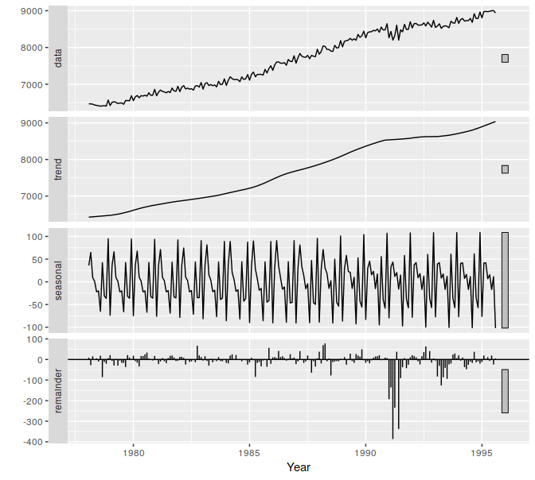
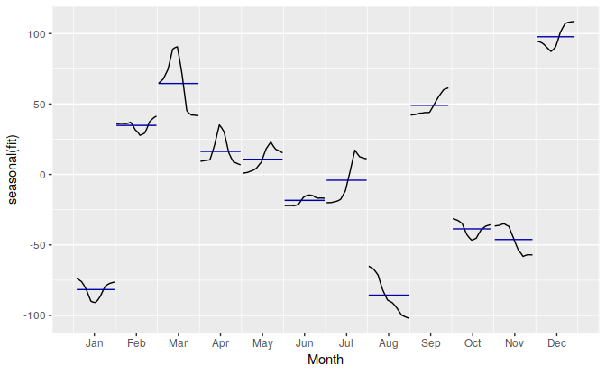

```{r setup, include=FALSE}
knitr::opts_chunk$set(echo = TRUE)
```


### Question 1: 
Show that a $3 \times 5$ MA is equivalent to a $7$-term weighted moving average with weights of $0.067$, $0.133$, $0.200$, $0.200$, $0.133$ and $0.067$.


### Question 2:
The `plastics` data set consists of the monthly sales (in thousands) of productA for a plastic manufacturer for five years.

(a) Plot the time series of product A. Can you identify seasonal fluctuations and/or a trend-cycle?

(b) Use a classical multiplicative decomposition to calculate the trend-cycle and seasonal indices.

(c) Do the results support the graphical interpretation from part a?

(d) Compute and plot the seasonally adjusted data.

(e) Change one observation to be an outlier (e.g., add $500$ to one observation) and recompute the seasonally adjusted data. What is the effect of the outlier?

(f) Does it make any difference if the outlier is near the end rather than in the middle of the time series? 


### Question 3: 
Recall your retail time series data (from Exercise $3$ in Section 2.10). Decompose the series using X11. Does it reveal any outliers, or unusual features that you had not noticed previously?


### Question 4: 
Figures 6.16 and 6.17 show the result of decomposing the number of persons in the civilian labour force in Australia each month from February $1978$ to August $1995$.

```{r, fig.cap="Figure 6.16: Decomposition of the number of persons in the civilian labour force in Australia each month from February 1978 to August 1995.", echo=FALSE}

```

```{r, fig.cap="Figure 6.17: Seasonal component from the decomposition shown in the previous figure.", echo=FALSE}

```

(a) Write about $3$ to $5$ sentences describing the results of the decomposiition. Pay particular attention to the scales of the graphs in making your interpretations.

(b) Is the recession of $1991$/$1992$ visible in the estimated components?


### Question 5:
This exercises uses the `cangas` data (monthly Canadian gas production in billions of cubic metres, January $1960$ - February $2005$).

(a) Plot the data using `autoplot()`, `ggsubseriesplot()` and `ggseasonplot()` to look at the effect of the changing seasonality over time. What do you think is causing it to change so much?

(b) Do an STL decomposition of the data. You will need to choose `s.window` to allow for the changing shape of the seasonal component.

(c) Compare the results with those obtained using SEATS and X11. How are they different?


### Question 6:
We will use the `bricksq` data (Australian quarterly clay brick production, $1956$ to $1994$) for this exercise.

(a) Use an STL decomposition to calculate the trend-cycle and seasonal indices. (Experiment with having fixed or changing seasonality.)

(b) Compute and plot the seasonally adjusted data.

(c) Use a naïve method to produce forecasts of the seasonally adjusted data.

(d) Use `stlf()` to reseasonalize the results, giving forecasts for the original data. 

(e) Do the residuals look uncorrelated?

(f) Repeat with the robust STL decomposition. Does it make much difference?

(g) Compare forecasts from `stlf()` with those from `snaive()`, using a test set comprising the last $2$ years of data. Which is better?


### Question 7:
Use `stlf()` to produce forecasts of the `writing` series with either `method="naive"` or `method="rwdrift"`, whichever is most appropriate. Use the `lambda` argument if you think a Box-Cox transformation is required.


### Question 8:
Use `stlf()` to produce forecasts of the `fancy` series with either `method="naive"` or `method="rwdrift"`, whichever is most appropriate. Use the `lambda` argument if you think a Box-Cox transformation is required.


#### Source: Hyndman, R.J., & Athanasopoulos, G. (2018) Forecasting: principles and practice, 2nd edition, OTexts: Melbourne, Australia. OTexts.com/fpp2. Accessed on August 1 2019.
