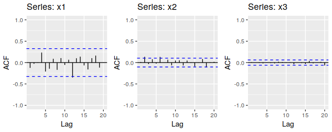

```{r setup, include=FALSE}
knitr::opts_chunk$set(echo = TRUE)
knitr::opts_chunk$set(eval = FALSE)
```

### Question 1: 
Figure 8.31 shows the ACFs for $36$ random numbers, $360$ random numbers and $1,000$ random numbers.
```{r, echo=FALSE,fig.cap="Figure 8.31: Left: ACF for a white noise series of 36 numbers. Middle: ACF for a white noise series of 360 numbers. Right: ACF for a white noise series of 1,000 numbers"}

```

(a) Explain the differences among these figures. Do they all indicate that the data are white noise?

(b) Why are the critical values at different distances from the mean of zero? Why are the autocorrelations different in each figure when they each refer to white noise?


### Question 2: 
A classic example of a non-stationary series is the daily closing IBM stock price series (data set `ibmclose`). Use `R` to plot the daily closing prices for IBM stock and the ACF and PACF. Explain how each plot shows that the series is non-stationary and should be differenced.


### Question 3: 
For the following series, find an appropriate Box-Cox transformation and order of differencing in order to obtain stationary data.

(a) `usnetelec`

(b) `usgdp`

(c) `mcopper`

(d) `enplanements`

(e) `visitors`


### Question 4: 
For the `enplanements` data, write down the differences you chose above using backshift operator notation.


### Question 5:
For your retail data (from Exercise $3$ in Section 2.10), find the appropriate order of differencing (after transformation if necessary) to obtain stationary data.


### Question 6:
Use `R` to simulate and plot some data from simple ARIMA models.

(a) Use the following `R` code to generate from an AR(1) model with $\phi_1 = 0.6$ and $\sigma^2 = 1$. The process starts with $y_1 = 0$.
```{r}
y = ts(numeric(100))
e = rnorm(100)
for(i in 2:100){
  y[i] = 0.6*y[i-1] + e[i]
}
```

(b) Produce a time plot for the series. How does the plot change as you change $\phi_1$?

(c) Write your own code to generate data from an MA(1) model with $\phi_1 = 0.6$ an d$\sigma^2= 1$.

(d) Produce a time plot for the series. How does the plot change as you change $\phi_1$?

(e) Generate data from an ARMA(1,1) model with $\phi_1 = 0.6$, $\theta_1 = 0.6$ and $\sigma^2 = 1$.

(f) Genreate data from an AR(2) model with $\phi_1 = -0.8$, $\phi_2 = 0.3$ and $\sigma^2=1$. (Note that these paramaters will give a non-stationary series.)

(g) Graph the latter two series and compare them.


### Question 7: 
Consider `wmurders`, the number of women murdered each year (per $100,000$ standard population) in the United States.

(a) By studying appropriate graphs of the series in `R`, find an appropriate ARIMA($p,d,q$) model for these data.

(b) Should you include a constant in the model? Explain.

(c) Write this model in terms of the backshift operator.

(d) Fit the model using `R` and examine the residuals. Is the model satisfactory?

(e) Forecast three times ahead. Check your forecasts by hand to make sure that you know how they have been calculated.

(f) Create a plot of the series with forecasts and prediction intervals for the next three periods shown.

(g) Does `auto.arima()` give the same model you have chosen? If not, which model do you think is better?


### Question 8:
Consider `austa`, the total international visitors to Australia (in millions) for the period $1980$ to $2015$.

(a) Use `auto.arima()` to find an appropriate ARIMA model. What model was selected? Check that the residuals look like white noise. Plot forecasts for the next $10$ periods.

(b) Plot forecasts from an ARIMA(0,1,1) model with no drift and compare these part a. Remove the MA term and plot again.

(c) Plot forecasts from an ARIMA(2,1,3) model with drift. Remove the constant and see what happens.

(d) Plot forecasts from an ARIMA(0,0,1) model with a constant. Remove the MA term and plot again.

(e) Plot forecasts from an ARIMA(0,2,1) model with no constant.


### Question 9: 
For the `usgdp` series:

(a) if necessary, find a suitable Box-Cox transformation for the data;

(b) fit a suitable ARIMA model to the transformed data using `auto.arima()`;

(c) try some other plausible models by experimenting with the others chosen;

(d) choose what you think is the best model and check the residual diagnostics;

(e) produce forecasts of your fitted model. Do the forecasts look reasonable?

(f) compare the results with what you would obtain using `ets()` (with no transformation).


### Question 10:
Consider `austourists`, the quarterly number of international tourists to Australia for the period $1999$ to $2010$.

(a) Describe the time plot.

(b) What can you learn from the ACF graph?

(c) What can you learn from the PACF graph?

(d) Produce plots of the seasonally differenced data $(1-B^4)Y_t$. What model do these graphs suggest?

(e) Does `auto.arima()` give the same model that you chose? If not, which model do you think is better?

(f) Write the model in terms of the backshift operator, then without using the backshift operator.


### Question 11: 
Consider `usmelec`, the total net generation of electricity (in billion kilowatt hours) by the U.S. electric industry (monthly for the period January $1973$ to June $2013$). In general there are two peaks per year: in mid-summer and mid-winter.

(a) Examine the $12$-month moving average of series to see what kind of trend is involved.

(b) Do the data need transforming? If so find a suitable transformation.

(c) Are the data stationary? If not, find an appropriate differencing which yields stationary data.

(d) Identify a couple of ARIMA models that might be useful in describing the time series. Which of your models is the best according to their AIC values?

(e) Estimate the parameters of your best model and do diagnostic testing on the residuals. Do the residuals resemble white noise? If not, try to find another ARIMA model which fits better.

(f) Forecast the next $15$ years of electricity generation by the U.S. electric industry. Get the latest figures from the EIA (https://bit.ly/usmelec) to check the accuracy of your forecasts.

(g) Eventually, the prediction intervals are so wide that the forecasts are not particularly useful. How many years of forecasts do you think are sufficiently accurate to be usable?


### Question 12:
For the `mcooper` data:

(a) if necessary, find a suitable Box-Cox transformation for the data;

(b) fit a suitable ARIMA model to the transformed data using `auto.arima()`;

(c) try some other plausible models by experimenting with the orders chosen;

(d) choose what you think is the best model and check the residual diagnostics;

(e) produce forecasts of your fitted model. Do the forecasts look reasonable?

(f) compare the results with what you would obtain using `ets()` (with no transformation).


### Question 13:
Choose one of the following seasonal time series: `hsales`, `auscafe`, `quaselec`, `qcement`, `qgas`.

(a) Do the data need transforming? If so, find a suitable transformation.

(b) Are the data stationary? If not, find an appropriate differencing which yields stationary data.

(c) Identify a couple of ARIMA models that might be useful in describing the time series. Which of your models is the best according to their AIC values?

(d) Estimate the parameters of your best model and do diagnostic testing on the residuals. Do the residuals resemble white noise? If not, try to find another ARIMA model which fits better.

(e) Forecast the next 24 months of data using your preferred model.

(f) Compare the forecasts obtained using `ets()`.


### Question 14: 
For the same time series you used in the previous exercise, try using a non-seasonal model applied to the seasonally adjusted data obtained from STL. The `stlf()` function will make the calculations easy (with `method="arima"`). Compare the forecasts with those obtained in the previous exercise. Which do you think is the best approach?


### Question 15:
For your retail time series (Exercise $5$ above):

(a) develop an appropriate seasonal ARIMA model;

(b) compare the forecasts with those you obtained in earlier chapters;

(c) obtain up-to-date retail data from the ABS website (https://bit.ly/absretail) (Cat 8501.0, Table 11), and compare your forecasts with the actual numbers. How good were the forecasts from the various models?


### Question 16: 
Consider `sheep`, the sheep population of England and Wales from $1867$ to $1939$.

(a) Produce a time plot of the time series,

(b) Assume you decide to fit the following model:
$$ y_t = y_{t-1} + \phi_1(y_{t-1} - y_{t-2}) + \phi_2(y_{t-2} - y_{t-3}) + \phi_3(y_{t-3} - y_{t-4}) + \varepsilon_t $$ 
where $\varepsilon_t$ is a white noise series. What sort of ARIMA model is this (i.e., what are $p$, $d$ and $q$)?

(c) By examining the ACF and PACF of the differenced data, explain why this model is appropriate.

(d) The last five values of the series are given below:
| Year | $1935$ | $1936$ | $1937$ | $1938$ | $1939$ | 
|------|--------|--------|--------|--------|--------|
| Millions of sheep | $1648$ | $1665$ | $1627$ | $1791$ | $1797$ |

The estimated parameters are $\phi_1=0.42$, $\phi_2 =-0.20$, and $\phi_3 = -0.30$. Without using the `forecast` function, calculate forecasts for the next three years ($1940$ to $1942$).

(e) Now fit the model in `R` and obtain the forecasts using `forecast`. How are they different from years? Why?


### Question 17:
The annual bituminous coal production in the United States from $1920$ to $1968$ is in data set `bicoal`.

(a) Produce a time series of the data.

(b) You decide to fit the following model to the series:
$$ y_t = c + \phi_1y_{t-1} + \phi_2y_{t-2} + \phi_3y_{t-3} + \phi_4y_{t-4} + \varepsilon_t $$ 
where $y_t$ is the coal production in year $t$ and $\varepsilon_t$ is a white noise series. What sort of ARIMA model is this (i.e., what are $p$, $d$ and $q$)?

(c) Explain why this model was chosen using the ACF and PACF.

(d) The last five values of the series are given below.
| Year | $1964$ | $1965$ | $1966$ | $1967$ | $1968$ | 
|------|--------|--------|--------|--------|--------|
| Millions of tons | $467$ | $512$ | $534$ | $552$ | $545$ |

The estimated parameters are $c = 162.00$, $\phi_1 = 0.83$, $\phi_2 = -0.45$, $\phi_3 = 0.55$ and $\phi_4 = -0.38$. Without using the `forecast` function, calculate the forecasts for the next three years ($1969$ to $1971$).

(e) Now fit the model in `R` and obtain the forecasts from the same model. How are they different from yours? Why? 


### Question 18:
Before doing this exercise, you will need to install the *Quandl* package in `R` using
```{r}
install.packages("Quandl")
```

(a) Select a time series from Quandl (https://www.quandl.com/). Then copy its short URL and import the data using
```{r}
y = Quandl("????", api_key="?????", type="ts")
```
(Rplace each `?????` with the appropriate values.)

(b) Plot graphs of the data, and try to identify an appropriate ARIMA model.

(c) Do residual diagnostic checking of your ARIMA model. Are the residuals white noise?

(d) Use your chosen ARIMA model to forecast the next four years.

(e) Now try to identify an appropriate ETS model.

(f) Do residual diagnostic checking of your ETS model. Are the residuals white noise?

(g) Use your chosen ETS model to forecast the next four years.

(h) Which of the two models do you prefer?


#### Source: Hyndman, R.J., & Athanasopoulos, G. (2018) Forecasting: principles and practice, 2nd edition, OTexts: Melbourne, Australia. OTexts.com/fpp2. Accessed on August 1 2019.
